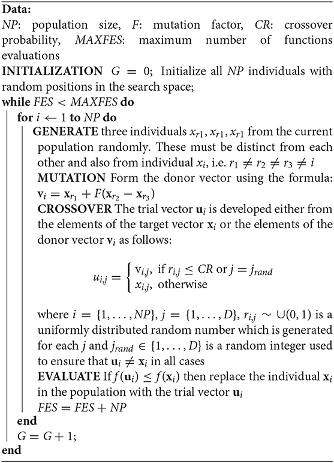

# Differential Evolution algorithm using Artificial Neural Network  

## Authors  
Jakub Gałat  
Konrad Kulesza  

## Description

Differential Evolution with a surrogate model aimed at cost function approximation. The task involves designing and implementing a surrogate model, which will in a adequate manner approximate cost function in the Differential Evolution algorithm. New specimen evaluation will use developed surrogate model, which will lead to reduced overhead connected to real cost function evaluation. The task also involves the basic Differential Evolution (without surrogate model) comparison.

## Work summary

We focused on analysis of Differential Evolution algorithm, both with and without surrogate model. Modified algorithm is compared to original by changing one of the parameters of both algorithms and comparing the averaged results. The experiments where conducted using quadratic function and Rosenbrock function. Due to not satisfying results of function approximation during tests on CEC2017 functions in 10 dimensions, we decided to halt experiments in that direction at the moment.

## Problem description

The most resource-hungry stage of Differential Evolution algorithm is specimen evaluation using cost function. The use of surrogate model mitigates the overhead required to evaluate (often complicated) functions describing some real phenomenon. Hence implementation of such model is a considerable option, however it comes with a price. It is often bound to the fact that it only approximates the real function, so the quality of results may differ (however sometimes it can be even better). 

## Solution description

Solution is implemented in Python, using Keras module. The Differential Evolution (DE) design follows written below:

In the case of Differential Evolution using Artificial Neural Network (DEANN), right after the *initialization* comes the stage of learning the neural network. The model is then used in *evaluate*, where it replaces original cost function. Influenced by the article ( [source](https://www.researchgate.net/publication/342548581_Using_Neural_Networks_as_Surrogate_Models_in_Differential_Evolution_Optimization_of_Truss_Structures) ), we decided that our neural network will have the *numberOfDimensions*-20-20-20-1 architecture. As a activation function we use ReLU in hidden layers.

Random number generation using Latin Hypercube Sampling ([wiki](https://en.wikipedia.org/wiki/Latin_hypercube_sampling)) from module pyDOE.

